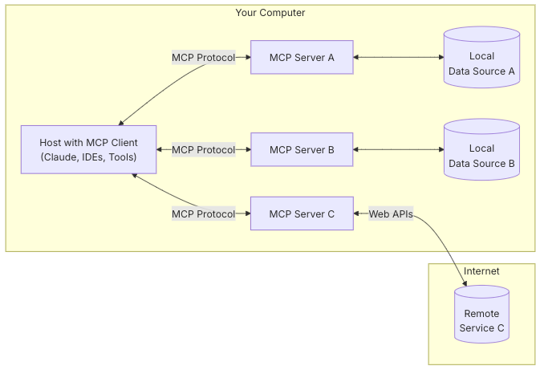
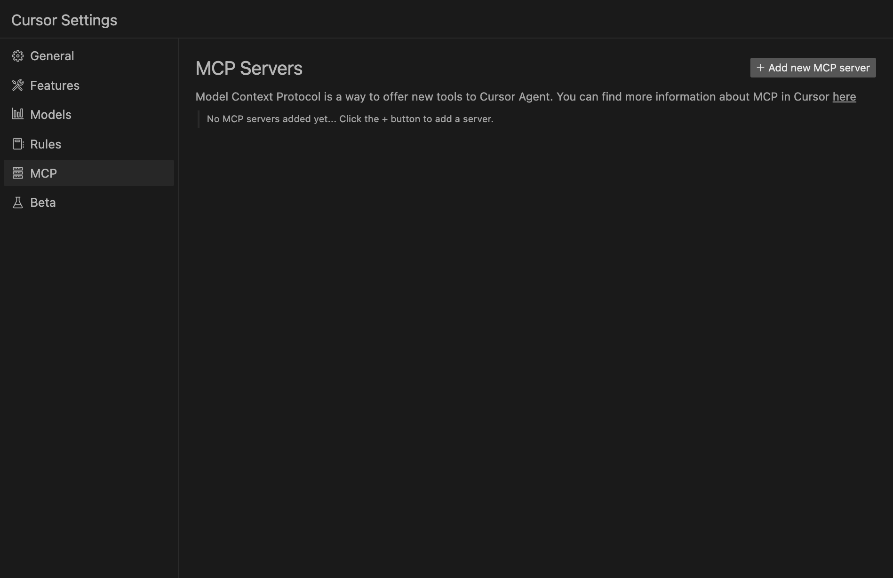
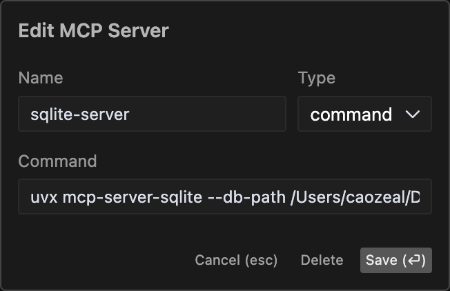
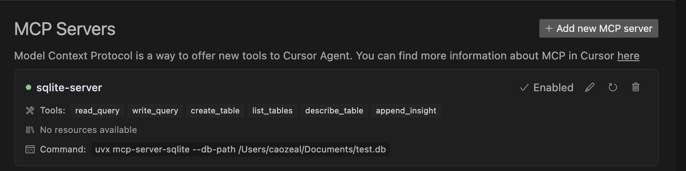
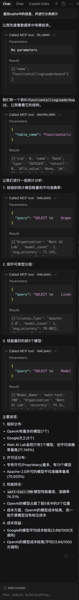
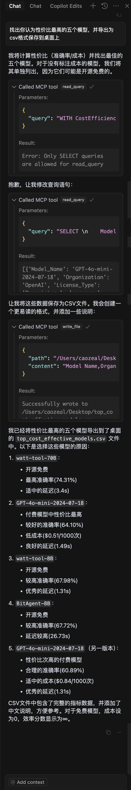
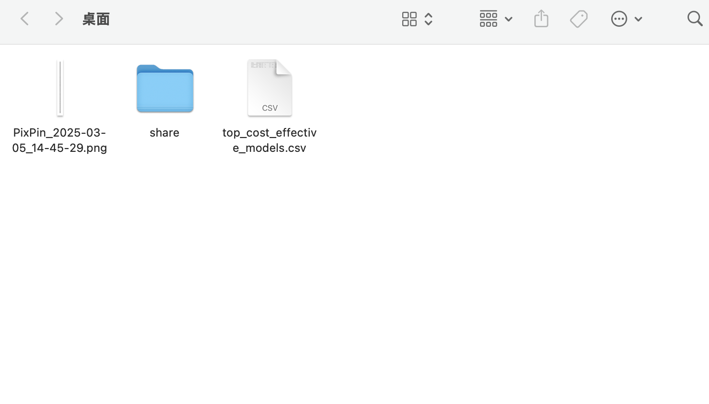

# MCP漫游

> 本文涉及关键词：AI, MCP, Claude, python, cursor

> Model Context Protocol (MCP) 是一个开放协议，它实现了AI应用与外部数据源之间的无缝集成。由Anthropic开源，其核心目标是标准化AI系统获取上下文的方式，使AI助手能够更好地访问和利用各类数据源。

## 一、从AIGC说起

AIGC（Artificial Intelligence Generated Content, AI生成内容）指的是利用人工智能技术自动生成文本、图像、音频、视频等内容，这是AI技术在创意领域的重要应用。如gpt系列、claude、deepseek等大型语言模型，dall-e、midjourney、stable diffusion等图像生成模型，以及suno、jukedeck等音乐生成AI等。经过了最近这几年的飞速发展，AIGC技术已经切实改变了我们的生活和工作方式。

纯粹的AIGC技术，可以是一位老师，可以是一枚网友，可以是一本翻译书，也可以是一位创作者，我们畅所欲言地与之交谈，不用担心被嘲笑问题的无知，也不会被嫌弃喋喋不休的探讨。

在经过一段时间的热切使用后，新鲜感退去，我们不禁思考，对话框之外，我们能用他(她)做什么？他（她）们是否能够不仅仅是“张嘴说话”，而是进一步，去“动手做事”？解析完excel后的数据是否可以不用复制粘贴到数据库或报告中，生成的命令是否可以直接运行，翻译后的文本自动替换到原文档中，生成的音乐是否可以直接上传到音乐平台，生成的图像是不是能够自动配上文案并发布到朋友圈？AI是否能做到这最后一步，乃至将他（她）的思想无限扩展，在整个互联网中
蔓延，做到万物互联的核心？答案是，当然可以，我们也确实是在向这个方向发展，MCP就是这么一个协议，将AI与外部工具连接，扩展AI边界。用MCP官网的话来说，“可以把 MCP 想象成 AI 应用的 USB-C 端口。就像 USB-C 为设备连接各种外围设备和配件提供了标准化的方式一样，MCP 为 AI 模型连接不同的数据源和工具提供了标准化的方式。”

> MCP is an open protocol that standardizes how applications provide context to LLMs. Think of MCP like a USB-C port for AI applications. Just as USB-C provides a standardized way to connect your devices to various peripherals and accessories, MCP provides a standardized way to connect AI models to different data sources and tools.

> *MCP 是一个开放协议，标准化了应用程序如何向LLMs提供模型上下文。可以把 MCP 想象成 AI 应用的 USB-C 端口。就像 USB-C 为设备连接各种外围设备和配件提供了标准化的方式一样，MCP 为 AI 模型连接不同的数据源和工具提供了标准化的方式。*

> -- MCP官网(https://modelcontextprotocol.io/introduction)

## 二、MCP概览

MCP是一种开放标准，使开发人员能够建立他们数据源和人工智能驱动工具之间的安全双向连接。该架构很简单：开发人员可以通过 MCP 服务器公开他们的数据，或者构建连接到这些服务器的人工智能应用程序（MCP 客户端）。

### MCP通用架构



MCP定义了三个主要角色：

1. Host: 发起连接的LLM应用，比如Claude Desktop, cursor等
2. Client: Host应用中的连接器，与服务器保持 1:1 连接
3. Server: 通过标准化的MCP暴露特定功能的轻量级程序

host通过client连接到server，大模型决策当前会话需要执行哪个serer的哪个命令，server负责处理数据的获取和处理。其中，client 于server之间的通信是通过MCP协议进行的。
目前server仅支持本地服务，更像是一个插件，即插即用。

### MCP试用
下面以cursor为例，引入sqlite数据库，展示MCP的工作流程。
其中：
- Host: cursor
- Client: cursor-mcp
- Server: sqlite mcp server

sqlite mcp server的具体配置可以参考[sqlite-mcp-server](https://github.com/modelcontextprotocol/servers/tree/HEAD/src/sqlite）

#### 1. 第一步打开cursor settings，选择MCP选项，点击“Add Server”添加一个新的MCP服务器



#### 2. 选择command，按照提示输入相关信息，点击“Add Command”添加一个新的命令，如下图所示



- uvx = uv tool run的缩写，表示运行uv工具，uv是一个Python包和项目管理器，这里代表这个MCP server是采用python实现的。（我们需要提前准备python环境，和安装uv）
- [sqlite-mcp-server](https://github.com/modelcontextprotocol/servers/tree/HEAD/src/sqlite）中介绍了claude desktop的配置方法，这里我们将其转化为cursor的配置即可：`uvx mcp-server-sqlite --db-path ~/test.db`， 或者在项目下`./.cursor/mcp.json`中按照claude desktop的配置方法配置：


claude desktop的配置方法：
```
# Add the server to your claude_desktop_config.json
"mcpServers": {
  "sqlite": {
    "command": "uv",
    "args": [
      "--directory",
      "parent_of_servers_repo/servers/src/sqlite",
      "run",
      "mcp-server-sqlite",
      "--db-path",
      "~/test.db"
    ]
  }
}
```

#### 3. 配置好之后，我们看到cursor的MCP服务器列表中已经添加了sqlite，并且成功获取到了server的一些信息。这时我们的cursor agent已经可以通过MCP协议来查询操作我们指定的sqlite数据库了。



#### 4. 数据库中我已经提前初始化了一些数据，现在我们可以通过agent来操作这些数据。

- User: 查找sqlite中的模型信息，并进行分类统计
- Agent: 



从图中可以看到，cursor agent通过MCP协议成功连接到了sqlite server，并且成功查询并进行了分析。同样地，我们添加filesystem-server，并让AI操作文件

- User: 找出你认为性价比最高的五个模型，并导出为csv格式保存到桌面上
- Agent:



此时打开桌面，已经生成了一个csv文件，并自动命名成了“top_cost_effective_models.csv”,打开文件，成功导出了五条数据，并在最后一列主动加入了理由。



## 三、离AGI还有多远

目前MCP还处于早期阶段，AI的边界还有待进一步拓展，上述的例子也只是不多（目前大约1500+）的MCP Server中的一粟，其他的server还有很多，比如浏览网页、请求接口、模拟用户行为浏览操作网页、读取google drive数据、查改mysql等数据库、git操作等等，我们可以利用这些server赋能大模型，扩展其边界，未来户发展到哪一步，还有多久能迈向AGI，我们拭目以待。

这两天，所谓首个通用AI Agent - Manus刷屏，试看了主页的几个例子，也都很流畅，从提出需求，到沟通、设计、编写，到最后的成果，确实令人神往，相信今后AI确实能做到这个程度，随着AI推理逻辑能力的提升，以后只会越来越顺畅。但现在，Manus是否能稳定做到演示中的那样，还是只是一场吸引眼球的秀，不妨让子弹飞一会。

## 四、参考资料

1. [Introducing the Model Context Protocol:  https://www.anthropic.com/news/model-context-protocol](https://www.anthropic.com/news/model-context-protocol)
2. [Model Context Protocol:  https://modelcontextprotocol.io/introduction](https://modelcontextprotocol.io/introduction)
3. [MCP Servers git仓库:  https://github.com/modelcontextprotocol/servers](https://github.com/modelcontextprotocol/servers)
4. [cursor网站介绍MCP:  https://docs.cursor.com/context/model-context-protocol](https://docs.cursor.com/context/model-context-protocol)
5. [pulse - MCP Servers收集:  https://www.pulsemcp.com/servers](https://www.pulsemcp.com/servers)
6. [一文详解 Claude 开源黑科技 MCP ｜ AI 精英周刊 012:  https://www.axtonliu.ai/newsletters/ai-2/posts/claude-mcp-protocol-guide](https://www.axtonliu.ai/newsletters/ai-2/posts/claude-mcp-protocol-guide)
7. [Manus官网:  https://manus.im/](https://manus.im/)