# MCP漫游（二）：深入服务端

 1. [MCP漫游](../MCP漫游.md)

 上文对MCP有了个整体的理解，本文将深入探讨MCP Server, 并照着示例实现一个简单的MCP Server。

## 一、初探MCP Server


 > MCP Servers: Lightweight programs that each expose specific capabilities through the standardized Model Context Protocol

 > *MCP 服务器：通过标准化的模型上下文协议暴露特定功能的轻量级程序*
 >      -- [MCP官网](https://modelcontextprotocol.io/introduction#general-architecture)

## 二、Goose

我们之前使用cursor演示了MCP的一些应用，但是cursor只有agent模式可以使用，每用一次都会消耗一次高级模型额度，claude desktop由于某些原因，使用难度更大。

那有没有其他更友好一些的MCP Client呢？有的。[MCP Client功能支持矩阵](https://modelcontextprotocol.io/clients#feature-support-matrix)中列出了20多个客户端，其中很多客户端支持自定义LLM api，降低了MCP的使用门槛，可以根据自己熟悉的或喜欢的去体验。我们先来看一下Goose，然后基于Goose来体验MCP Server。

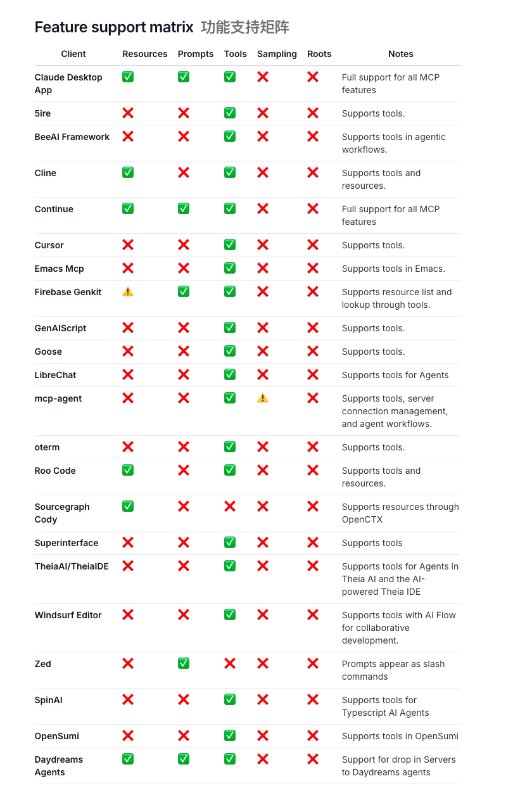

### 1. 安装

[Goose](https://block.github.io/goose/docs/quickstart) 是一个开源的人工智能助手，通过自动化编码任务来加速你的软件开发，macOS、Linux和Windows WSL都可以运行Goose CLI，macOS也支持桌面端Goose Desktop。

- 安装Goose CLI

```bash
curl -fsSL https://github.com/block/goose/releases/download/stable/download_cli.sh | bash
```

或者
- 安装Goose Desktop（macOS）

```bash
brew install --cask block-goose
```
或者直接下载客户端：[Goose Desktop macOS Sillcon](https://github.com/block/goose/releases/download/stable/Goose.zip)

### 2. 配置大模型

以桌面版举例，安装好之后打开，我们就可以来配置自定义大模型。

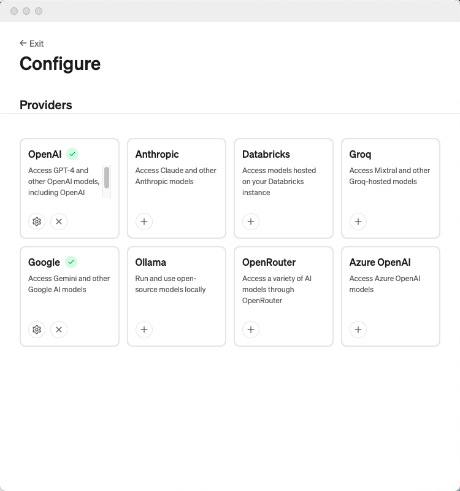

众所周知，大模型providers中没有自己期望的话，都可以往OpenAI中配置😶‍🌫️，我这里使用了[阿里云百炼](https://bailian.console.aliyun.com/#/model-market)，配置如下：
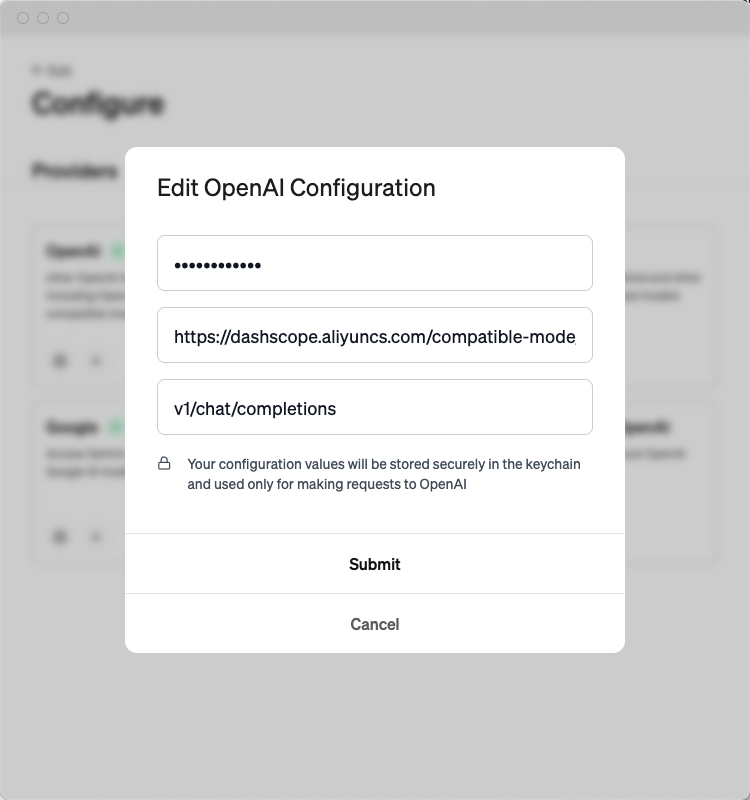

百炼中支持的模型还是比较多的，而且大部分都有100万的免费token额度，还是比较良心的。

### 3. 选择模型
配置好provider后，就可以选择模型了，不是所有的模型都支持MCP，需要模型具有Function Calling能力，[伯克利函数调用排行榜](https://gorilla.cs.berkeley.edu/leaderboard.html)中可以作为我们选择模型的参考，通义千问中支持Function Calling的模型可以参考：[通义千问Function Calling](https://help.aliyun.com/zh/model-studio/user-guide/qwen-function-calling)。这里我使用了`qwen-plus`。

### 4. 管理Extensions（即MCP Server）

Goose Desktop中提供了Extensions管理功能，可以方便地管理。`Settings -> Extensions`中我们可以看到已经启用了几个默认的插件， 点击`Broswe`可以浏览更多。

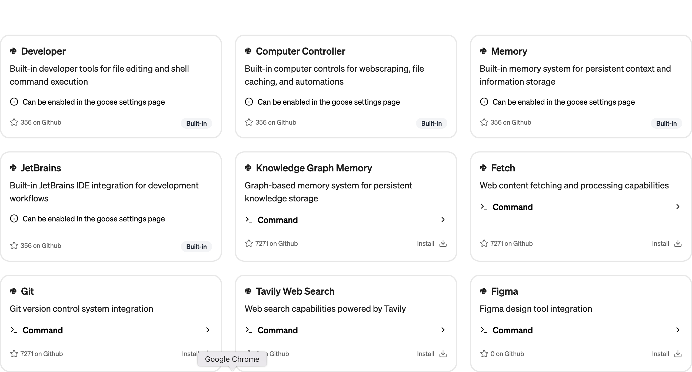

### 5. 使用

我们照例，问一句：“你会做什么？”

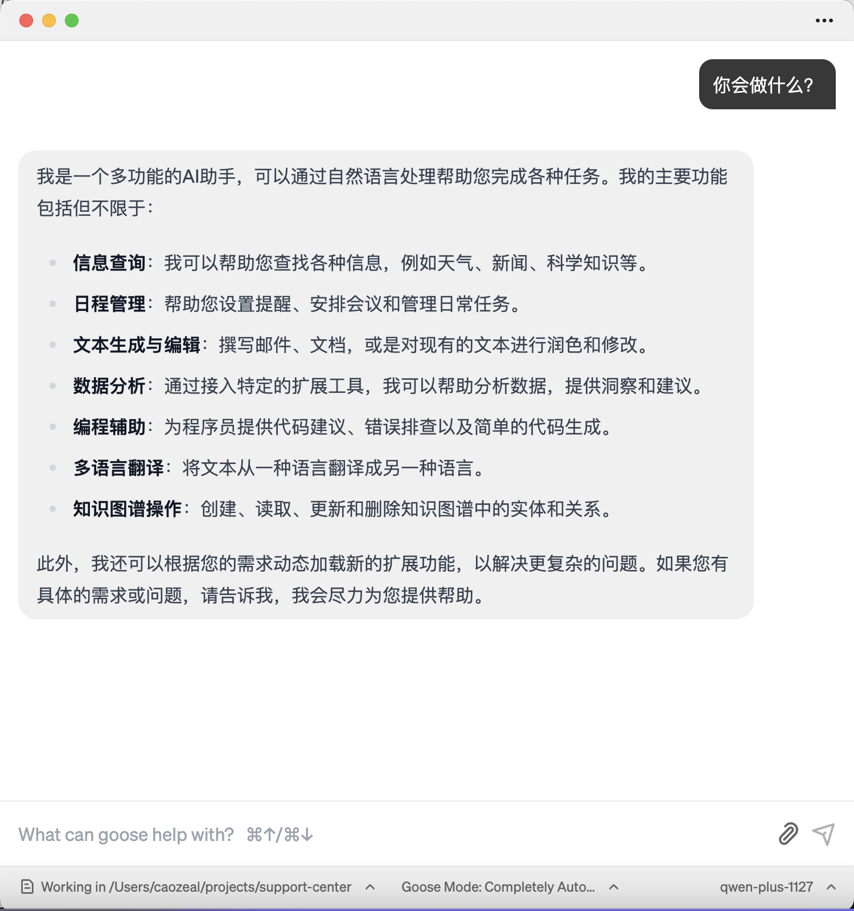

嗯，听起来会的还挺多。
- 搜索最近关于人工智能突破的近期新闻，并总结关键发现

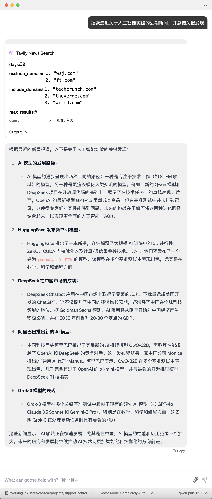

成功搜索并总结关键发现，顺便夸了一下中国。

接下来，我们尝试按照示例编写一个简单的MCP Server，并通过Goose Desktop来体验它。

## 三、让大鹅飞

官网示例地址：https://modelcontextprotocol.io/quickstart/server

MCP Server可以提供三种主要类型的功能：Resources、Tools、Prompts。这次我们跟着教程开发一个Tools -- 一个简单的获取天气的MCP Server。

教程里可以选择Python, Node, Java，这里我们选择Python。

### 1. 准备环境

首先是安装uv，我们上文已经安装了uv，这里就不再赘述了。然后初始化项目：

```bash
uv init weather
cd weather

# 创建虚拟环境并激活
uv venv
source .venv/bin/activate

# 安装依赖
uv add "mcp[cli]" httpx

# 创建server文件
touch weather.py
```

### 2. 实现MCP Server

实现代码就不一一赘述，按照官网示例中编写即可，可以看到几个关键点：

- 初始化了一个FastMCP server

```python
# Initialize FastMCP server
mcp = FastMCP("weather")

```

- 定义了该server具体的工具：`get_weather`和`get_weather_forecast`

```python
# Define tools
@mcp.tool
async def get_forecast(latitude: float, longitude: float) -> str:
    """Get weather forecast for a location.

    Args:
        latitude: Latitude of the location
        longitude: Longitude of the location
    """
    #实际处理数据
    #返回prompt给大模型分析
```

### 3. 工作流程

当你发送了一个问题，MCP实际做了这些：
1. 客户端将你的问题和可能使用的工具发送给大模型
2. 大模型分析你的问题，并决定使用哪个工具
3. 客户端通过 MCP 服务器执行所选的工具（或工具集）
4. 执行结果被发送回大模型
5. 大模型获取结果后，整理总结返回

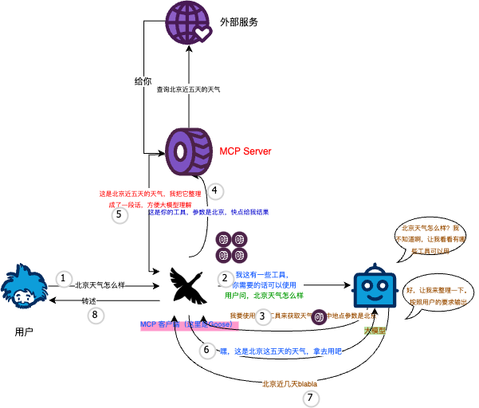

### 4. 体验

我们将我们的MCP Server添加到Goose Desktop中，选择`Add Custom Extension`，依次添加配置即可。Command填写`uv --directory /ParentFolder/weather run weather.py`即可

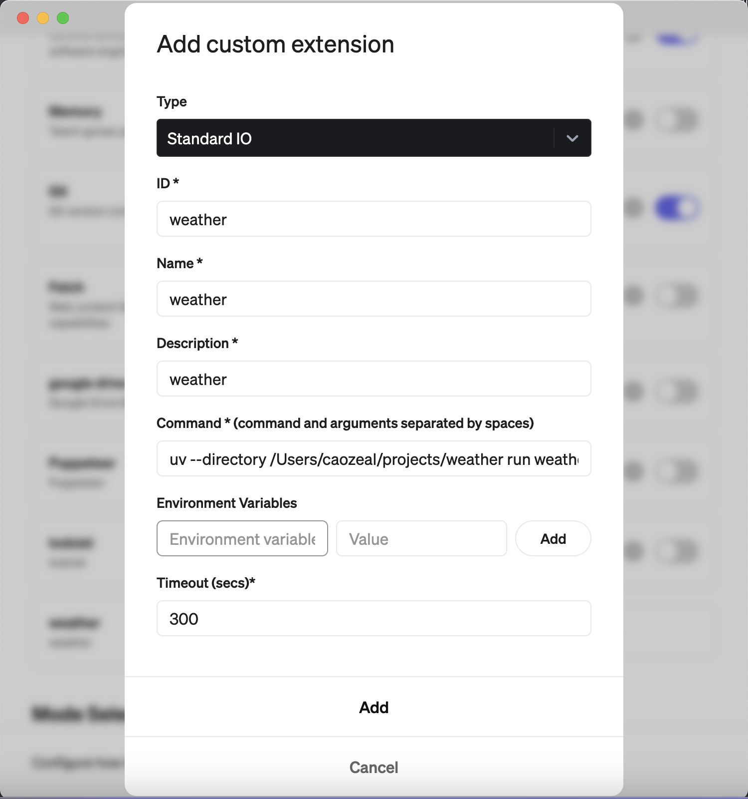

让我们来试一下：
- 北京的天气怎么样？

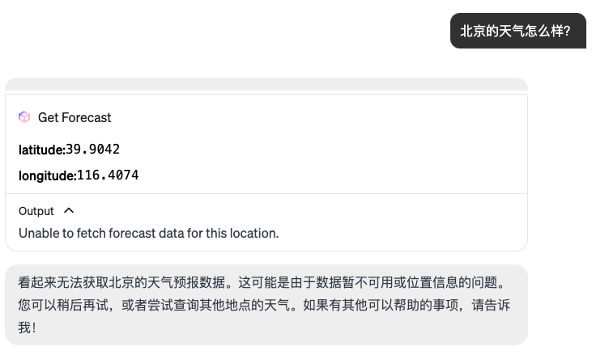

代码中调用的是（https://api.weather.gov -- 美国国家气象局）的API，看来无法查询北京，不过可以看到，大模型成功选择并调用Tool，北京被成功解析成了经纬度。让我们来试试纽约

- 纽约的天气怎么样？

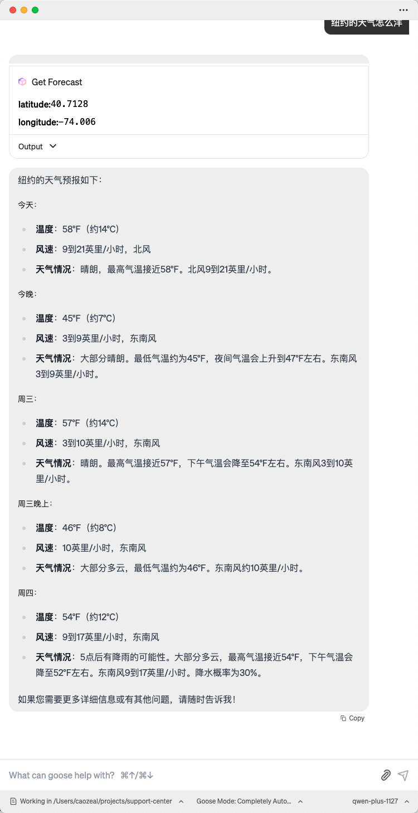

哈，这次成功了，并按照要求返回了纽约的天气预报，这次Goose完全可以扮演我们的穿衣建议助手了。

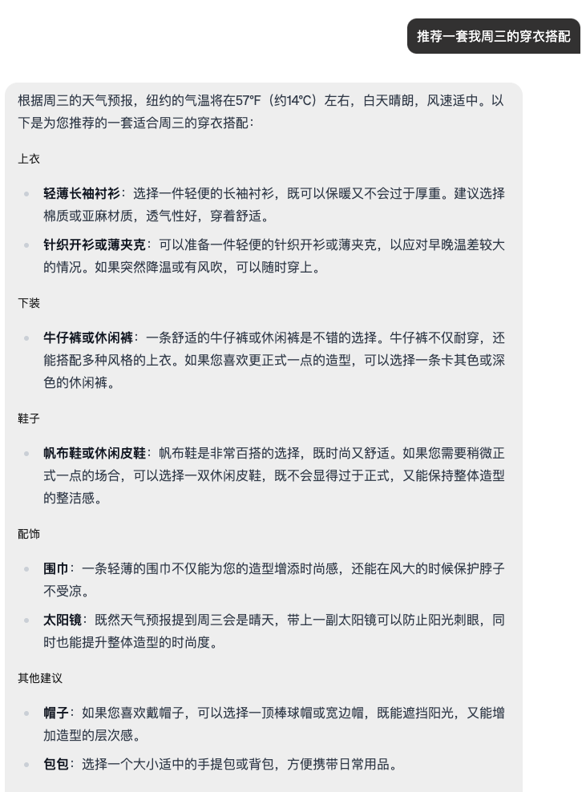

## 四、最后

通过这次体验，我们发现MCP Server的实现并不复杂，只需要定义好工具，并实现具体的处理逻辑即可。Goose Desktop的体验也非常不错，可以方便地管理Extensions，并提供了丰富的功能。大家感兴趣的话强烈建议尝试一下。

（不过话说回来， 带上工具后的请求，消耗的token也是如流水一般，三句简单的提问，干出了10万+的token，体验的时候一定要多多注意自己的账单~）


## 五、参考资料

- [MCP官网](https://modelcontextprotocol.io/quickstart/server)
- [Goose](https://block.github.io/goose/docs/quickstart)
- [伯克利函数调用排行榜](https://gorilla.cs.berkeley.edu/leaderboard.html)
- [通义千问Function Calling](https://help.aliyun.com/zh/model-studio/user-guide/qwen-function-calling)

