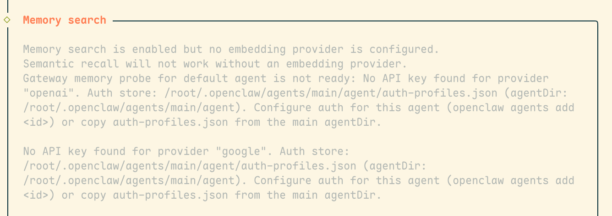
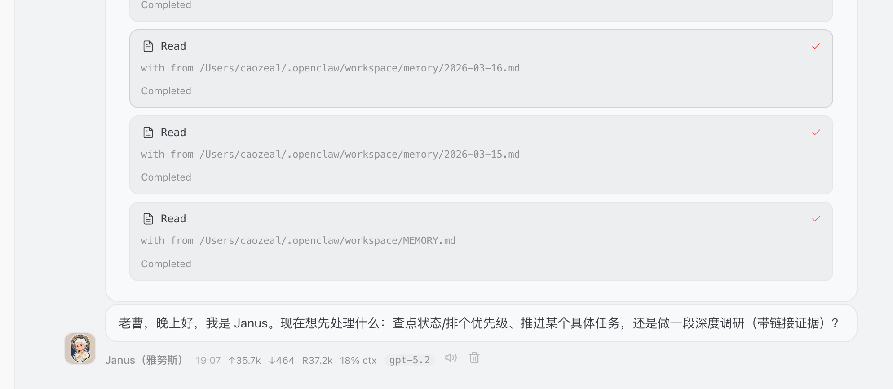
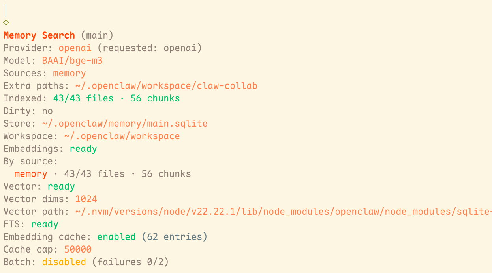
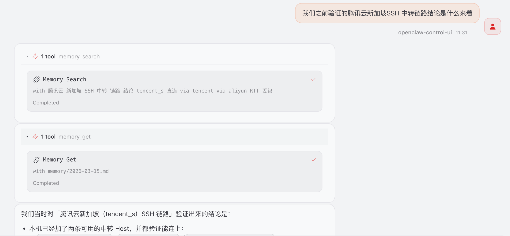
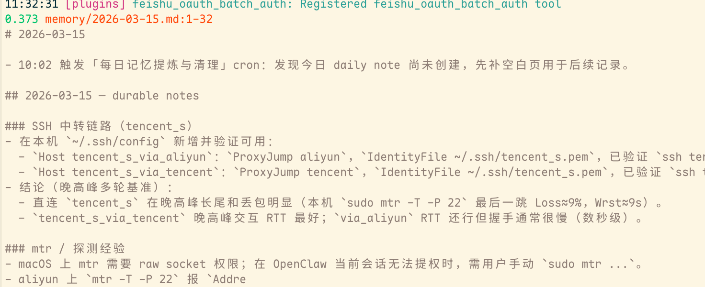
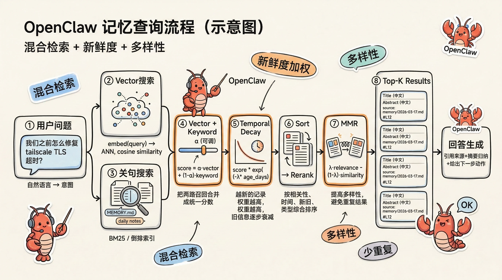

# OpenClaw Memory 机制：龙虾🦞如何能记得又多又好？（含配置与避坑）

很多 AI 助手给人的感觉是：它好像记得，但你一换会话、隔几天再问，就像失忆一样。

OpenClaw 其实有一套“可验证”的记忆系统：文件记忆（MEMORY/daily）+ 混合检索（全文 + 向量）。这篇我会把它讲清楚，并给你一套我实测可用的配置：怎么开、怎么省钱、怎么验证真的生效。

其实接触OpenClaw以来，一直没有深入了解过Memory机制，只知道是由长期记忆（`MEMORY.md`） + 每日记忆 （`memory/YYYY-MM-DD.md`）共同组成，以Markdown文档的形式存储，需要回忆的时候，我以为只会使用全文检索的形式去查询。

偶然间在升级后修复时，看到了如下的提醒：


才知道原来龙虾内置了记忆**向量检索**的功能，只是因为没有配置嵌入模型导致没有生效，还说什么，这不得立刻用起来。

## 一、Memory机制

如开头所说，OpenClaw默认使用两层记忆：长期记忆（`MEMORY.md`） + 每日记忆 （`memory/YYYY-MM-DD.md`），当我们新建对话时，它会首先加载长期记忆与最近两天的记忆，全量放入上下文中作为”基座“。



所以龙虾们会对我们最近两天的记忆和写入长期记忆的事情记得很清楚，而早些时候的记忆可能就没法信手拈来了。因此我们如果有很重要的事情需要让他记住的话，最好是能够特别强调”将这些写入MEMORY.md文档“、”将这些存到长期记忆“。

（ps: 上图出场的是我的首席龙虾 - Janus（雅努斯），欢迎👏🏻）

但需要注意的是，不加控制的话，MEMORY文档中越来越多，可能会造成恐怖的上下文增长，对钱包和效率上来说成为压力，我们可以使用心跳机制（HEARTBEAT） 或者 定时任务 （CRON）让他们定时整理记忆，增大组织效率，也可以利用上述机制，将每日记忆中有价值的定时存入长期记忆中。


## 二、Memory检索

知道了上边的机制，我们就能理解为什么会用到向量检索了。OpenClaw默认就是Hybrid Search（混合检索），支持BM25（全文检索）和向量检索相配合的方式，详细机制和原理可以参考官方文档，我们直接开始配置。

### 2.1最小配置项

```json
//其他配置
"agents": {
    "defaults": {
      //其他配置
      "memorySearch": {
        "provider": "openai",
        "model": "BAAI/bge-m3", // 或三方支持的 embedding 模型名
        "fallback": "none",
        "remote": {
          "baseUrl": "https://api.siliconflow.cn/v1",
          "apiKey": "sk-xxx"
          // headers: { "X-Whatever": "..." } // 如三方需要额外头
        }
      }
      //其他配置
    }
  },
  //其他配置
```

出于服务器性能考虑，还是优先选择了远端 embedding，这里我使用了硅基流动的免费嵌入模型。
除了上边的参数外，还可以选择
1. `hybrid` 混合检索，默认开启，还有`vectorWeight`，`textWeight`可以选择，用以调整向量权重与文本权重
2. `extraPaths` 添加额外的检索路径，给龙虾添加一个外置大脑，我尝试下把为他们构建的团队合作仓库加进去：`"extraPaths": ["claw-collab"]`，这儿可以是绝对路径，或者是workspace下的相对路径
3. `multimodal` 多模态记忆，目前只支持`gemini-embedding-2-preview`
4. `mmr` 按照最大边际相关性重排序，平衡相关性和多样性，确保排名靠前的结果涵盖查询的不同方面，而不是重复相同的信息，当记忆越来越多的时候这个很有用
5. `temporalDecay` 时间衰减，新的记忆优先于旧记忆，同样的，当我们和龙虾相处的越来越久，同一件事情，记忆有冲突时，这个配置也很有用
6. `cache` 嵌入缓存，开启后会将 chunk 嵌入缓存到 SQLite 中，在重复索引/重建索引/频繁增量更新时，遇到未变化的文本就不需要再次调用 embedding 生成，能够省时、省钱、也更稳定
7. `session-memory-search` session记忆检索，开启后会检索实际的聊天记录，实际的session文件位置：`~/.openclaw/agents/<agentId>/sessions/*.jsonl`，如果开启的话会占用更多的性能
  - ```json
	   "memorySearch": {
	      "experimental": { sessionMemory: true },
	      "sources": ["memory", "sessions"]
	   }
    ```
8. `sqlite-vec` OpenClaw 可以利用 sqlite-vec 加速向量检索；是否启用取决于你当前环境的 SQLite 以及扩展是否能加载

### 2.2 最终我这部分配置为：

```json
"memorySearch": {
        "provider": "openai",
        "model": "BAAI/bge-m3", // 或三方支持的 embedding 模型名
        "fallback": "none",
        "remote": {
          "baseUrl": "https://api.siliconflow.cn/v1",
          "apiKey": "sk-xxx"
          // headers: { "X-Whatever": "..." } // 如三方需要额外头
        },
        "extraPaths": ["claw-collab"],
        "cache": {
          "enabled": true,
          "maxEntries": 50000
        },
        "query": {
          "hybrid": {
            "enabled": true,
            "vectorWeight": 0.7,
            "textWeight": 0.3,
            "candidateMultiplier": 2,
            // Diversity: reduce redundant results
            "mmr": {
              "enabled": true, // default: false
              "lambda": 0.7 // 0 = max diversity, 1 = max relevance
            },
            // Recency: boost newer memories
            "temporalDecay": {
              "enabled": true, // default: false
              "halfLifeDays": 30 // score halves every 30 days
            }
          }
        }
      }
```

大家可以参考，或者丢给龙虾让他自己配置。

配置完成后，重启网关`openclaw gateway restart` ，并重建索引 `openclaw memory index --force` ，然后我们查看memory索引状态` openclaw memory status --deep`:


如果你一个网关配置了多个agent，就会发现其他的agent报了`Issues:additional memory path missing (~/.openclaw/workspace-searcher/claw-collab)`，这说明该配置是所有agent共享的，我们可以使用相对路径让每个agent配置不同的`外挂`，或使用绝对路径，让多个agent共享同一知识库。

### 2.3 效果验证

可以看到，成功创建了索引，下面我们来试试效果：


可以看到已成功查询并且找出了具体文档和内容，我们也可以使用`openclaw memory search "xxx"`来直接验证



至此已经差不多配置好了。



## 三、QMD

我们查看官方文档，可以看到记忆向量索引不仅有内置的，还支持QMD后端。

>   QMD - Query Markup Documents
>   
>    An on-device search engine for everything you need to remember. Index your markdown notes, meeting transcripts, documentation, and knowledge bases. Search with keywords or natural language. Ideal for your agentic flows.  
>   
>    一款运行在本地的搜索引擎，帮助你记住所有重要内容。索引你的 Markdown 笔记、会议记录、文档和知识库。支持关键词或自然语言搜索。非常适合接入你的智能体工作流。

简单地说，就是做本地知识库管理的一个专用搜索引擎，可以用来替代OpenClaw内置的向量搜索引擎，我们可以通过如下配置开启：
```json
"memory": {
    "backend": "qmd",
    "citations": "auto",
    "qmd": {
      "command": "~/.bun/bin/qmd",
      "searchMode": "search",
      "includeDefaultMemory": true
     }
}
```

当然我们得首先安装qmd cli，可以参考qmd官方文档，配置中的`command`需要配置实际安装的路径。

### QMD的限制：
- 仅支持本地嵌入模型，对于性能羸弱的服务器，这一项可以直接pass
- 中文搜索较差，**QMD 在搜索时会过滤中文单字**，导致查询效果不理想，参考文档我放到最后，大家有兴趣的话可以查看

我测试使用了`Qwen3-Embedding-0.6B-Q8_0.gguf`作为嵌入模型，初次构建缓存的时候占用了5个G以上内存，`searchMode`使用search查询确实不够精准，`searchMode`修改为vsearch后，查询内存占用和时间都大幅增长。大家感兴趣的话可以自行尝试。

## 四、总结

整体来说，还是建议开启内置的Hybrid Search，并配置上在线嵌入模型，有很多便宜或者免费的在线模型供我们选择。当然服务器配置尚可的可以尝试本地嵌入模型，安全性与稳定性上来说能提升一些。其他的配置按需选取，定制空间还是有的，也可以让我们的小龙虾也帮我们评估。


## 参考资料

1. [OpenClaw官方文档](https://docs.openclaw.ai/concepts/memory)
2. [QMD git仓库](https://github.com/tobi/qmd)
3. [OpenClaw Memory 系统终极优化指南](https://yla9mbfraa.feishu.cn/docx/BPQmdEKiEoUheCxbWFmcJekinJg)
