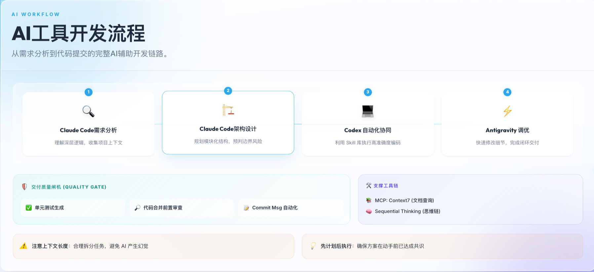

# 我的 AI Coding 工具选择与实践

站在现在这个时间点来看，AI Coding确实已经进入了白热化阶段。

从模型上来讲，国外三巨头Claude 、GPT、Gemini 频繁升级版本，且都对编码能力做了特化，国内deepseek稳中求变，豆包、千问也先后推出编码特化模型，GLM、Kimi、MiniMax争先拥抱以Claude Code为首的各种编码辅助工具。

从工具上来讲，Github Copilot率先布局，随后cursor一鸣惊人，Cline（含Roo Code, Kilo Code）系列插件广为人使用，随后的Claude Code仿佛杀死了比赛，独揽霸权，Kiro，Codex，Gemini Cli，Antigravity等先后推出，百花齐放。

一方面，Code Agent是通向AGI的一个核心阶段，万物互联，皆以程序驱动，编码赋予AI通向一切互联网可达之触手；另一方面，逐步脱离IDE的AI Code Agent形态降低了更多非编程从业人员的入门门槛，丰富的想象力、各行业清晰的洞察力、独树一帜的见解与敢于人先的尝试精神成为创造的核心能力，编码不再是拦路虎，一切皆有可能。


> 图片源自网络

## 一、行业现状：码农的红利 or 末日？

AI Coding工具早不是那个只能产出玩具代码的时代了，针对大模型AI Code 的测试也逐渐升级，从六边形弹球、三维世界模拟到鹈鹕骑自行车、天气卡片，各大厂的工具平台（包括Claude Code）都有着大量AI开发参与的痕迹，各式各样的非编程从业人员涌入了开发赛道，开发网站的专业性与美观确实让人佩服。部分实例如下：

[fast3d](https://fast3d.io/)


[raphael](https://raphael.app/)


在AI的加持下，非程序员的研发能力迅速追上程序员"正规军"，基于个人对AI工具的使用能力，研发能力上限被无限拉高，甚至能超过大部分不会使用AI的开发。码农的红利 or 末日？时代确实变了。

## 二、个人实践：多 Agent 协作工作流

### 2.1 工具链组合

受限于单一工具的使用成本，与各模型、工具能力差异，每个人对 AI 工具选择有着各自的喜好，我大部分时间都在开发后端代码，因此主要使用 Claude Code + Codex + Antigravity 配合开发，Kiro Code 生成提交代码与兜底。

整套的核心是 Claude Code（以下简称 CC），由 CC 进行需求分析与架构设计，掌控大局，由 Codex（仔细谨慎，以下简称 CX）进行具体的后端代码开发，Gemini（审美）进行前端页面设计（如有需要），Antigravity 则以其快速响应的优势，快速修改问题，进行局部调整优化。

### 2.2 协作架构




### 2.3 安装与配置

CC 的安装可以参考：[cc 自定义 API 接入及安装指南](/html/ai/claude-code-install.html)

VSCode 及其衍生 IDE（cursor、antigravity、kiro、trae 等）直接通过扩展市场安装，然后参考上述修改配置文件即可。

### 2.4 详细协作参考
- [Claude Code 与 Codex 协作开发 3.0：从 MCP 到 Skills 的技术演进](https://mp.weixin.qq.com/s/w-jv5FVU3puOqGRpJXvE5w)（该公众号还有其他更好的协作与之后的演化，我感觉这个最适合我，感兴趣可以查看他的其他文章）


## 三、AI Coding 技巧（以Claude Code为例）

### 3.1 基础信息

**支持途径：** Claude Code 套餐、API

**支持端：** CLI、VSCode 插件、客户端（仅支持官方账号）

**模型选择：**
- **Haiku**：快速模型，单价最低，速度最快，用于处理前期准备搜索工作
- **Sonnet**：常规模型，能力均衡，性价比高
- **Opus**：最强模型，价格最贵，4.5 版本迎来降价，由于更智能，能使用更快更少的步骤完成任务，变相降低消费，成为很多人的第一选择
- 也可通过 ClaudeCodeRouter、NewApi 等工具接入，或者办理 GLM、MiniMax、Kimi 等编程套餐来体验其他模型

### 3.2 核心特性

1. **三种工作模式**

   Claude 有三个模式，Plan Mode、默认模式、accept edits，可以 Shift + Tab 切换，可以在配置文件中配置默认的模式，比如：
   ```bash
   "permissions": {
       "defaultMode": "plan"
   }
   ```

   - **Plan Mode**：计划模式，CC 不会修改代码，他会整体查找分析和用户需求相关的代码与文档，给出实现方案，该模式下常常会触发 `AskUserQuestion` 来询问用户，给出选择以补充策略。
   - **默认模式**：此时会修改代码，修改时会征求用户同意
   - **Accept Edits**：此时会修改代码，并且不征求用户同意，直接修改
   - **最佳实践**：Explore first, then plan, then code - 这是 CC 官方推荐的最佳实践，先进入 Plan 模式，让 Claude 进行需求相关代码的探索，然后进行计划，此时我们要根据计划是否完善进行审查，若有偏离及时沟通纠正。当确认计划没问题后，选择同意计划并进入 accept edits，此时 CC 会按照计划来修改代码。
   - 因此推荐添加上述配置，默认计划模式

2. **上下文管理策略**

   任何大模型都有最大窗口限制，Claude 也不例外，虽然 CC 有自动压缩机制，但是压缩后的上下文准确度大幅下降，过量的上下文对钱包也是一种灾难。因此一个窗口尽量只实现一个功能，也就是进行一次探索→计划→实现→测试，以开发需求为例，最佳实践为：

   - 与 CC 讨论整体需求架构，可以粘贴需求文档、原型截图等
   - 确定整体架构后，拆分功能模块，按探索→计划→实现→测试的步骤逐步实现模块
   - 若是实现一个模块之后发现与预期有偏差，偏差大了→直接回退代码，重开窗口重新设计实现，特别少的局部偏差→当前窗口内要求修改，处于上述两种情况中间→新开窗口，要求修改

3. **斜杠命令（Slash Command）**

   CC 有着很多的斜杠命令（slash command），可以自行探索

4. **MCP、Skills、SubAgent 机制**

   Claude Code 有着完善的 MCP、skills、subAgent 机制：

   - **MCP**：每个 MCP 的 Token 占用相对较大，通常建议仅配置必须的 MCP，如：Context7、sequential-thinking 等
   - **Skills**：近几个月流传出来的概念，可以看做是优化版的 MCP，采用了渐进式上下文的技术来优化上下文占用，可以在 CLAUDE.md 中指明什么时候使用什么技能，也可以在对话中明确要求。
   - **SubAgent**：子代理，CC 会并行调用多个子代理来完成不同的任务，也可以自定义不同的个性化子代理
   - 完全可以通过对话的方式直接添加，比如跟 CC 说"帮我安装一下 MCP：Context7"

5. **CLI 灵活性与 Bash 模式**

   CC CLI 比 CC 插件更灵活，可以在任意地方唤起，并且在 CC 中能够使用 `!` 来切换到 bash 模式

   

6. **多场景应用能力**

   CC 除了编程、测试、排查问题外，你也可以让他执行很多其他事，比如："合并代码到 develop 并推送"、"检查当前分支相对于 release 分支的变更"、"清理系统磁盘"等系统操作，甚至可以"查找 github 中最热门项目"等 web 操作查询。

### 3.3 使用技巧

1. **配置优化（自定义 API 接入）**

   自定义 API 接入的话，配置文件最好添加上：
   ```bash
   "env": {
       "ANTHROPIC_AUTH_TOKEN": "xxx",
       "ANTHROPIC_BASE_URL": "http://xxx",
       "CLAUDE_CODE_DISABLE_NONESSENTIAL_TRAFFIC": "1",
       "DISABLE_TELEMETRY": "1"
   }
   ```

   - `"CLAUDE_CODE_DISABLE_NONESSENTIAL_TRAFFIC": "1"`：禁用非必要流量
   - `"DISABLE_TELEMETRY": "1"`：禁用遥测
   - 上述两个配置减少非必要的请求与 token 消耗

2. **及时 Commit 避免代码丢失**

   当你认可某次 AI 修改的内容，及时 commit，否则你很大几率会体验刚写好的代码被 AI 删除的灾难

3. **提前理解需求避免返工**

   使用 AI 编程很重要的一个就是，需要提前理解透需求，在开发前，自己的理解，与 AI 讨论进行理解。千万要避免边开发边理解，AI 开发后的返工简直是灾难。

**参考资料：**
- [CC 官方文档](https://code.claude.com/docs/en/overview)

## 四、总结与展望

AI Coding 让更多的人能实现自我创意，编程不再是技术壁垒，重复性工作、样板代码生成、API 调用等场景效率也显著提升。

目前AI Coding也进入了高速发展的快车道，被裹挟在其中的我们何去何从，是每个人都要思考的课题。
