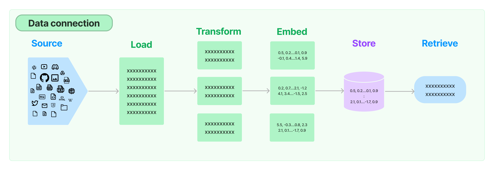

# LangChain学习笔记（一）

> 文中大部分都可以在[官方文档](https://python.langchain.com/)中找到，示例为自己的实践，有条件可以直接参考官方文档。

## 1. 什么是LangChain

> LangChain is a framework for developing applications powered by language models. We believe that the most powerful and differentiated applications will not only call out to a language model via an api, but will also:
> 1. Be data-aware: connect a language model to other sources of data
> 2. Be agentic: Allow a language model to interact with its environment

> LangChain是一个用于开发由语言模型驱动的应用程序框架。我们相信，最强大和有差异化的应用程序不仅会通过API调用语言模型，还会具备以下特点：
> 1. 数据感知：将语言模型连接到其他数据源。
> 2. 智能代理：允许语言模型与其环境进行交互。

随着chatgpt的火爆，大型语言模型（LLMs）正在成为一种具有变革性的技术，围绕大语言模型的辅助开发框架LangChain也问世了，它不仅可以使我们更方便的调用大语言模型的api，也可以使其与其他的资源（数据源/shell/api）进行交互，充分发挥大语言模型的能力。

### 模块
LangChain有六个模块：
1. Model I/O(IO模型)：提供与大语言模型进行交互的接口

2. Data Connection(数据连接)：提供特定于应用数据的接口

3. Chains：通用解释为对组件的调用序列，可以将多个调用链接起来
4. Memory(记忆模块)： 用于保留一个chain中应用程序的状态
5. Agents(代理模块)：提供其他工具的代理，使得chain可以决定并使用某些工具，比如执行shell命令，调用google api进行搜索等
6. Callbacks(回调模块)：用于日志记录、监控、流式传输等

## 2. 构建应用

### 2.1 安装
```bash
pip install langchain  #安装langchain
pip intstall openai    #安装openai
```

- 设置`OPENAI_API_KEY`环境变量

### 2.2 通过大语言模型获取预测
对大语言模型基础的调用

```python
from langchain.llms import OpenAI

# temperature: 0.0-2.0, 越大越随机；model：默认使用text-davinci-003
llm = OpenAI(temperature=0.9, client="llms", model="text-davinci-003")

print(llm.predict("列举三种水果"))
#也可以写作
print(llm("列举三种水果"))
```
输出：
```bash
苹果、梨、橘子
```

### 2.3 对对话模型的调用
聊天模型是大语言模型的变体。与大语言模型不同的是，大语言模型以文本进行交互，聊天模型可以使用`AIMessage`,`HumanMessage`,`SystemMessage`进行交互，分别对应openai中的`system`,`user`,`assistant`角色。

```python
from langchain.cache import Base
from langchain.chat_models import ChatOpenAI
from langchain.schema import (HumanMessage, SystemMessage)

# model 默认使用gpt-3.5-turbo
chat = ChatOpenAI(temperature=0.9, client="chat")
result = chat.predict_messages(
    [
        SystemMessage(content="以下是AI助手与人类之间的友好对话。"),
        HumanMessage(content="把这句话翻译为英语：我爱你。"),
    ])

print(result)
```
输出：
```bash
content='The translation of this sentence to English is: "I love you."' additional_kwargs={} example=False
```

当然也可以直接以文本进行交互
```python
print(chat.predict("把这句话翻译为英语：我爱你。"))
```
输出：
```bash
I love you.
```

### 2.4 Prompt templates(提示模板)
便于根据不同的上下文来生成不同的prompt，应用程序调用起来更灵活

```python
from langchain.prompts import (ChatPromptTemplate, SystemMessagePromptTemplate, HumanMessagePromptTemplate)

system_template = "你是一个翻译助手，帮助人们把{源语言}翻译为{目标语言}"
system_message_prompt = SystemMessagePromptTemplate.from_template(system_template)
human_template = "{文本}"
human_message_prompt = HumanMessagePromptTemplate.from_template(human_template)

chat_prompt = ChatPromptTemplate.from_messages([system_message_prompt, human_message_prompt])

format = chat_prompt.format_messages(源语言="汉语", 目标语言="英语", 文本="我爱你")

print(format)
```
输出：
```bash
[SystemMessage(content='你是一个翻译助手，帮助人们把汉语翻译为英语', additional_kwargs={}), HumanMessage(content='我爱你', additional_kwargs={}, example=False)]
```

用于后续调用
```python
chat = ChatOpenAI(temperature=0.9, client="chat")
print(chat.predict_messages(format))
```
输出：
```
content='I love you.' additional_kwargs={} example=False
```

### 2.5 Chains
我们也可以使用chain来组装model和prompt
```python
# 在2.4的基础上添加
from langchain import LLMChain

chain = LLMChain(llm=chat, prompt=chat_prompt)
result = chain.run(源语言="汉语", 目标语言="英语", 文本="我爱你")

print(result)
```
输出：
```bash
I love you.
```

### 2.6 Agents
使用代理来调用工具以完成更复杂的任务。使用代理分为三步：
1. 选择语言模型：LLM/Chat Model
2. 选择工具：例如，Google Search，Shell, ChatGPT Plugins等
3. 构建代理

比如我们可以使用SerpAPI通过谷歌搜索某些东西并进行简单的数学计算：
- 安装包：`pip install google-search-results`
- 设置环境变量：`SERPAPI_API_KEY`

```python
from langchain.agents import AgentType, initialize_agent, load_tools
from langchain.llms import OpenAI

llm = OpenAI(temperature=0, client="agent", model="text-davinci-003")

# serpapi: 可以用来调用google的api，llm-math：进行数学计算
tools = load_tools(["serpapi", "llm-math"], llm)

# AgentType.ZERO_SHOT_REACT_DESCRIPTION：直译就是零样本_反应_描述，仅通过描述来确定使用哪个工具
# verbose=True： 显示详细描述（可以理解为AI的心路历程）
agent = initialize_agent(tools, llm, AgentType.ZERO_SHOT_REACT_DESCRIPTION, verbose=True)

print(agent.run("北京昨天最高气温是多少摄氏度？然后算一下这个数字的平方根"))
```
输出：
```bash
> Entering new  chain...
 I need to find the temperature first, then calculate the square root
Action: Search
Action Input: "Beijing yesterday highest temperature"
Observation: Beijing Temperature Yesterday. Maximum temperature yesterday: 102 °F (at 5:00 pm) Minimum temperature yesterday: 72 °F (at 5:00 am) Average temperature ...
Thought: I need to convert the temperature to Celsius
Action: Calculator
Action Input: 102 Fahrenheit to Celsius
Observation: Answer: 38.888888888888886
Thought: I now need to calculate the square root
Action: Calculator
Action Input: 38.888888888888886^(1/2)
Observation: Answer: 6.236095644623235
Thought: I now know the final answer
Final Answer: The highest temperature in Beijing yesterday was 38.888888888888886°C and the square root of this number is 6.236095644623235.

> Finished chain.
The highest temperature in Beijing yesterday was 38.888888888888886°C and the square root of this number is 6.236095644623235.
```

功能很强大，但实际体验下来不是特别美好，一是不稳定，经常需要查询很多次才能得到结果，二是描述稍微模糊或者复杂一点，得到的结果可能就是错误的，或者没法带入到下一步，直接报错 ~~摆烂~~。
serpapi注册用户每月有100次免费的谷歌调用，经不起折腾，不过我们可以来尝试下免费的duckduckgo search ~~(鸭鸭狗）~~)
- 安装`pip install duckduckgo-search`

```python
from langchain.llms import OpenAI
from langchain.agents import initialize_agent, AgentType, load_tools

llm = OpenAI(temperature=0, client="agent", model="text-davinci-003")
tools = load_tools(["ddg-search", "llm-math"], llm)
agent = initialize_agent(tools, llm, AgentType.ZERO_SHOT_REACT_DESCRIPTION, verbose=True)
print(agent.run("北京昨天最高气温是多少摄氏度？然后算一下这个数字的平方根"))
```
输出：
```bash
> Entering new  chain...
 I need to find the highest temperature in Beijing yesterday and then calculate the square root of that number
Action: duckduckgo_search
Action Input: "Beijing highest temperature yesterday"
Observation: By Reuters BEIJING, June 22 — The temperature in Beijing breached 106 degrees Fahrenheit on Thursday and shattered the record for the hottest day in June as heatwaves that had seared nort
hern... On Friday, Beijing baked in temperatures as high as 40.3C, after sizzling at 41.1C on Thursday, the second-hottest day recorded by the Chinese capital in modern times. Beijing's all-time high of ... The city experienced its all-time recorded high of 41.9 C (107 F) on July 24, 1999. Chinese meteorologists say the current heat wave was caused by warm air masses associated with high-pressure ridges in the atmosphere, 
compounded by thin cloud covers and long daylight hours around the summer solstice. Last week, Beijing recorded its highest temperature for mid-June, with weather officials warning the public to stay indoors as the mercury hit 39.4C. With Agence France-Presse and Reuters... Beijing recorded a high temperature of 41.1 C yesterday (Jun 23) as the capital city continues to experience an ongoing heatwave, according to a report from Beijing News (新京报). This isn't the first time the city has seen the heat cranked up to over 41 C, but the first time it's happened in June.
Thought: I now have the highest temperature in Beijing yesterday
Action: Calculator
Action Input: 41.1
Observation: Answer: 41.1
Thought: I now know the final answer
Final Answer: The highest temperature in Beijing yesterday was 41.1°C and its square root is 6.4.
```

一次查询便得到了结果，效果似乎更好，不过日期错了，并不是昨天😭

也可以调用本地shell:
```python
from langchain.llms import OpenAI
from langchain.agents import initialize_agent, AgentType, load_tools

llm = OpenAI(temperature=0, client="shell", model="text-davinci-003")

tools = load_tools(["terminal", "llm-math"], llm)
self_ask_with_search = initialize_agent(
    tools, llm, agent=AgentType.CHAT_ZERO_SHOT_REACT_DESCRIPTION, verbose=True
)
self_ask_with_search.run("get the memory info by GB")
```

### 2.7 Memory
维护程序状态，拥有上下文记忆
```python
from langchain.prompts import (ChatPromptTemplate, SystemMessagePromptTemplate, HumanMessagePromptTemplate, MessagesPlaceholder)
from langchain.chains import ConversationChain
from langchain.chat_models import ChatOpenAI
from langchain.memory import ConversationBufferMemory

prompt = ChatPromptTemplate.from_messages([
    SystemMessagePromptTemplate.from_template(
        "以下是AI助手与人类之间的友好对话。"
    ),
    MessagesPlaceholder(variable_name="history"),
    HumanMessagePromptTemplate.from_template("{input}")
])

llm = ChatOpenAI(temperature=0, client="memory")
memory = ConversationBufferMemory(return_messages=True)
conversation = ConversationChain(memory=memory, prompt=prompt, llm=llm)

while True:
    user = input("用户: ")
    answer = conversation.predict(input = user)
    print("AI助手：", answer)
```
我们与AI进行交互：
```bash
用户: 你好
AI助手： 你好！有什么我可以帮助你的吗？
```
接下来验证确实存在记忆：
```bash
用户: 我说的是上一句话是什么
AI助手： 你说的上一句话是"你好"。
```

## 3. 最后
LangChain的大体功能如上，与LLMs一样，目前也在蓬勃发展阶段，由于大语言模型的不稳定性，现在使用起来还有很多不尽如人意的地方，但是我们也可以看到其潜力和愿景。个人觉得，agents部分是最吸引人的地方，将LLMs的能力由文本延伸到程序之外，极大地提升了想象空间。
更多内容可以查看[官方文档](https://python.langchain.com/)。

## 附：参考链接&文档

1. [官方文档](https://python.langchain.com/)