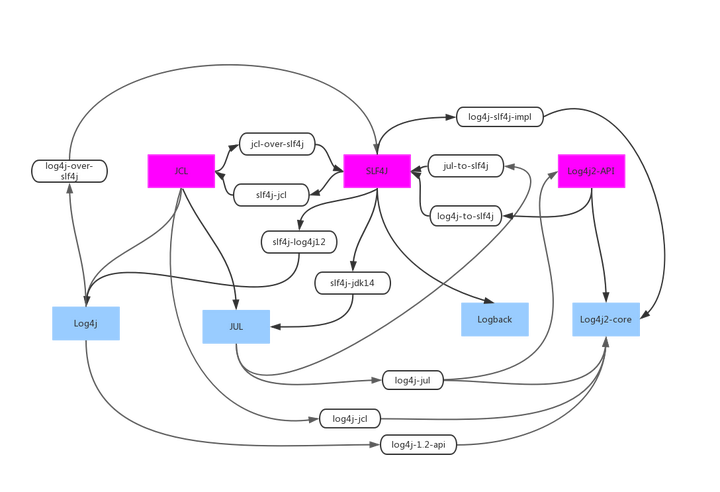
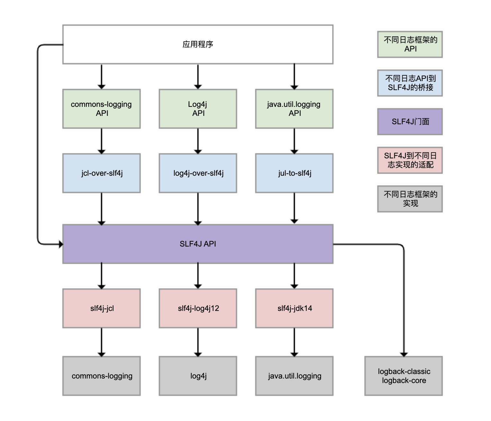
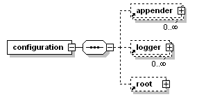
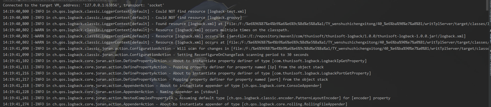
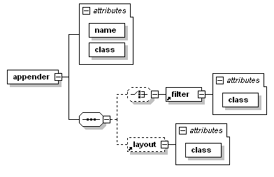
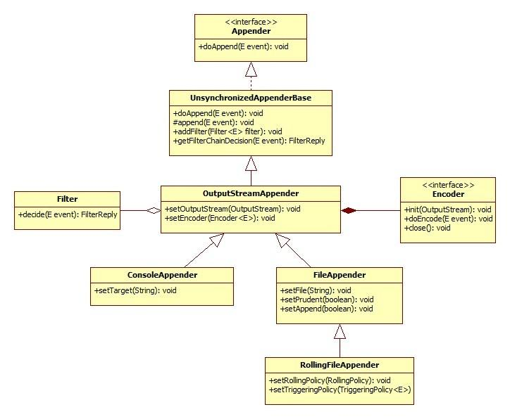

# java日志相关介绍

### 一、初期日志记录

回想一下，自己在刚接触java的时候是怎么记录日志信息的。通常我们会使用 `System.out.println()`输出调试日志信息，使用 `System.err.println()`输出错误日志信息，使用 `e.printStackTrace()`来输出异常堆栈信息。

实际上，在日志框架出现之前，大家都是这样使用的；而现在则会被前辈们千叮咛万嘱咐，不要使用这些来记录日志信息。而为什么有了日志框架就不能使用这些原始的记录方式了，大家有没有仔细思考过？

其实sonar中有一条规则很详细地为我们解释了原因：

> ### Standard outputs should not be used directly to log anything
>
> - 异味
> - 主要
> - 主要代码
>
> When logging a message there are several important requirements which must be fulfilled:
>
> - The user must be able to easily retrieve the logs
> - The format of all logged message must be uniform to allow the user to easily read the log
> - Logged data must actually be recorded
> - Sensitive data must only be logged securely
>
> If a program directly writes to the standard outputs, there is absolutely no way to comply with those requirements. That's why defining and using a dedicated logger is highly recommended.

即，标准输出流已经无法满足我们对于日志记录的需求了，这时日志记录框架便诞生了。

### 二、日志框架演进概述

通常我们目前使用的框架是slf4j和logback结合的方式，你是否有过疑惑，记录日志为什么要是用两个日志框架呢，他们的职责又分别是什么？

#### 1.log4j

早年，使用**log4j**框架来记录日志，使用如下代码来输出日志

```java
import org.apache.log4j.Logger;
\\省略
Logger logger = Logger.getLogger(Test.class);
logger.trace("trace");
\\省略
```

#### 2. J.U.L

但是后续，JDK加入了**J.U.L**(java.util.logging)，推出了官方的日志记录框架。这是一部分人想要把自己项目中的日志记录框架改为J.U.L，需要怎么做呢？找出所有使用log4j api的代码，将其手动一行一行改为J.U.L的api，即

```java
import java.util.logging.Logger；
\\省略
Logger loggger = Logger.getLogger(Test.class.getName()); 
logger.finest("finest");
\\省略
```

### 3. J.C.L

可以看出，切换日志记录框架十分不方便，日后再出现更优秀的日志记录框架该怎么办呢。这时候Apache的**JCL**（commons-logging）诞生了。JCL是一个Log Facade（即日志门面框架），只提供 Log API，不提供实现，然后有 Adapter 来使用 Log4j 或者 JUL 作为Log Implementation。真正干事的还是后方的日志记录框架（log4j、J.U.L）。目的就是之后再出现更优秀的日志记录框架的时候，开发者不用改代码（即不用切换log api），只需改配置就可平滑切换到新的日志记录框架中。

#### 4. SLF4J  &  Logback

事情到这里似乎已经尘埃落定了，完成了Log Facade + Log 两层框架的体系。这套框架也具备了上面所说的日志记录的四项能力。

但是我们目前使用的日志门面框架通常是SLF4J，而不是最初的JCL。那SLF4J是具备了哪些更优秀的品质，而让我们去选择了它呢？其中比较重要的一点是SLF4J中的占位符模式，能够一定程度上减少字符串拼接的开销。

JCL推荐写法：

```java
if (logger.isDebugEnabled()) {
    logger.debug("start process request, url:" + url);
}
```

SLF4J写法：

```java
logger.debug("start process request, url:{}", url);
```

logback则是继承自log4j，增加了异步logger、filter等特性。

#### 5. Log4j2

包括日志门面框架log4j-api和日志记录框架log4j-core，由维护log4j的人开发而来，不兼容log4j

下面放两个各框架间的关系图来感受下：





下面以SLF4J和Logback为例来讲一下日志框架使用：

### 三、Logback

> Logback is intended as a successor to the popular log4j project

这里就不从头说logback的所有配置了，logback的核心配置都在logback.xml文件中，这里讲几个常用的配置：

```xml
<?xml version="1.0" encoding="UTF-8"?>
<configuration debug="false" scan="true" scanPeriod="30 seconds">
	<statusListener class="ch.qos.logback.core.status.NopStatusListener" />
	<appender name="stdout" class="ch.qos.logback.core.ConsoleAppender">
		<filter class="ch.qos.logback.classic.filter.ThresholdFilter">
			<level>${logback.stdout.level}</level>
		</filter>
		<Target>System.out</Target>
		<encoder>
			<pattern>
			   %d{yyyy-MM-dd HH:mm:ss.SSS}[%-5level][%thread][%logger{20}:%L] %msg%n
			</pattern>
		</encoder>
	</appender>
	<appender name="R"
		class="ch.qos.logback.core.rolling.RollingFileAppender">
		<File>${LOG_HOME}/${SYSTEM_NAME}_stdout_${ip}_${port}.log</File>
		<encoder>
			<pattern>
			   %d{yyyy-MM-dd HH:mm:ss.SSS}[%-5level][%thread][%logger{20}:%L] %msg%n
			</pattern>
		</encoder>
		<rollingPolicy class="ch.qos.logback.core.rolling.TimeBasedRollingPolicy">
			<fileNamePattern>${LOG_HOME}/${SYSTEM_NAME}_stdout_${ip}_${port}.%d.log
			</fileNamePattern>
		</rollingPolicy>
	</appender>
	<logger name="org.springframework" level="error" />
	<logger name="org.apache" level="error" />
	<root level="${logback.root.level}">
		<appender-ref ref="stdout" />
		<appender-ref ref="R" />
	</root>
</configuration>
```

- 配置文件语法:

  - 结构：`<configuration>`元素、0个或多个 `<appender>`元素、0个或多个 `<logger>`元素、最多一个 `<root>`元素
  - 
  - 标签名大小写敏感
- `<configuration>`：logback 将写入日志事件的任务委托给一个名为 appender 的组件。

  - `debug`：控制是否输出logback本身的一些状态信息
  - 
  - `scan="true" `当配置文件更改时，自动加载配置，默认扫描间隔1min
  - `scanPeriod="30 seconds"`每30s自动扫描一次配置看是否有更改
- `<statusListener>`：状态信息监听器

  - `OnConsoleStatusListener`：同 `debug=true`，将状态信息打印到控制台中
  - ```java
    protected PrintStream getPrintStream() {
        return System.out;
    }
    ```
  - `NopStatusListener`：丢弃所有状态信息
  - ```java
    public void addStatusEvent(Status status) {
        // nothing to do
    }
    ```
  - `OnErrorConsoleStatusListener`：在控制台打印错误信息
  - ```java
    protected PrintStream getPrintStream() {
        return System.err;
    }
    ```
- `<appender>`：

  - 
  - `name`：appender的名字，用于下文logger或root引用
  - `class`：appender所采用的具体类
    - 
    - `ch.qos.logback.core.ConsoleAppender`：将日志事件附加到控制台，就是通过 *System.out* 或者 *System.err* 来进行输出。默认通过前者。
    - `ch.qos.logback.core.rolling.RollingFileAppender`：将日志事件输出到文件中。通过 `file` 来指定目标文件。在满足了特定的条件之后，将日志输出到另外一个文件。
  - `filter`
    - `ch.qos.logback.classic.filter.ThresholdFilter`：基于给定的临界值来过滤事件。如果事件的级别等于或高于给定的临界值，当调用 `decide()` 时，`ThresholdFilter` 将会返回 `NEUTRAL`。但是事件的级别低于临界值将会被拒绝。
    - `ch.qos.logback.classic.filter.LevelFilter`：事件的级别与配置的级别相等，会调用 `onMatch`属性配置，不相等会调用 `OnMismatch`属性配置
  - `Target`
    - `ConsoleAppender`使用，设置为*System.out* 或 *System.err*。默认为 *System.out*
  - `encoder`：`encoder` 将日志事件转换为字节数组，同时将字节数组写入到一个 `OutputStream` 中。
    - `pattern`：`PatternLayoutEncoder`
  - `rollingPolicy`
    - `TimeBasedRollingPolicy`：
    - `SizeAndTimeBasedRollingPolicy`：
- `<logger>`：

  - `name`
  - `level`：TRACE，DEBUG，INFO，WARN，ERROR，ALL，OFF，INHERITED，NULL。当 `level` 的值为 INHERITED 或 NULL 时，将会强制 logger 继承上一层的级别
  - `<appender-ref>`：使用的appender，会继承上一级的appender
- `<root>`：与 `<logger>`相似，根logger，不能设置name、additivity，level不能设置为INHERITED，NULL。

### 四、SLF4J

- 创建Logger
  - `Logger logger = LoggerFactory.getLogger(HelloWorld.class);`
  - 集成lombok插件，可以在类上使用 `@Slf4j`创建
- 使用
  - `logger.info("some message");`
  - `logger.error("some message", e)`
  - 占位符模式：`logger.debug("some message: {}", message, e)`
  - Fluent Logging API（slf4j-api 2.0.0版本以上）：
    - `logger.atInfo().log("some message")`
    - ` logger.atDebug().addArgument(newT).addArgument(oldT).log("Temperature set to {}. Old temperature was {}.");`
    - `logger.atDebug().addKeyValue("oldT", oldT).addKeyValue("newT", newT).log("Temperature changed.");` == `logger.debug("oldT={} newT={} Temperature changed.", newT, oldT);`

### 五、日志规约（《阿里代码规约》）

#### 1.【强制】应用中不可直接使用日志系统（Log4j、Logback）中的API，而应依赖使用日志框架 SLF4J中的API，使用门面模式的日志框架，有利于维护和各个类的日志处理方式统一。

#### 2.【强制】在日志输出时，字符串变量之间的拼接使用占位符的方式。

*说明*：因为String字符串的拼接会使用StringBuilder的append()方式，有一定的性能损耗。使用占位符仅是替换动作，可以有效提升性能。

*正例*：`logger.debug("Processing trade with id: {} and symbol: {}", id, symbol);`

#### 3.【强制】对于trace/debug/info级别的日志输出，必须进行日志级别的开关判断。

说明：虽然在debug(参数)的方法体内第一行代码isDisabled(Level.DEBUG_INT)为真时（Slf4j的常见实现Log4j和Logback），就直接return，但是参数可能会进行字符串拼接运算。此外，如果debug(getName())这种参数内有getName()方法调用，无谓浪费方法调用的开销。

> 如果参数内有方法调用或者字符串拼接，则必须进行日志级别的开关判断，否则不需要强求

*正例*：

```java
// 如果判断为真，那么可以输出trace和debug级别的日志 
if (logger.isDebugEnabled()) {
    logger.debug("Current ID is: {} and name is: {}", id, getName()); 
}
```

#### 4. 【强制】异常信息应该包括两类信息：案发现场信息和异常堆栈信息。如果不处理，那么通过关键字throws往上抛出。

*正例*：`logger.error(param.toString() + "_" + e.getMessage(), e);`

#### 5.【推荐】谨慎地记录日志。生产环境禁止输出debug日志；有选择地输出info日志；如果使用warn来记录刚上线时的业务行为信息，一定要注意日志输出量的问题，避免把服务器磁盘撑爆，并记得及时删除这些观察日志。

 说明：大量地输出无效日志，不利于系统性能提升，也不利于快速定位错误点。记录日志时请思考：这些日志真的有人看吗？看到这条日志你能做什么？能不能给问题排查带来好处？

#### 6.【推荐】可以使用warn日志级别来记录用户输入参数错误的情况，避免用户投诉时，无所适从。如非必要，请不要在此场景打出error级别，避免频繁报警。

 说明：注意日志输出的级别，error级别只记录系统逻辑出错、异常或者重要的错误信息。

### 六、后记

规则终究是死的，记日志的时候需要结合具体场景多做思考，在哪里记日志能帮助后续排查问题？哪里的日志又是重复记录乃至无效日志？结合异常处理来看，哪些异常应该抛给上层调用方，根据上层应用不同场景选择不同的处理方式；哪些异常应该就地给解决了，处理异常的时候一定要记录一下异常信息。

## 附：参考链接&文档

1. [Standard outputs should not be used directly to log anything](http://sonar.thunisoft.com/coding_rules?activation=true&open=java%3AS106&q=Stand&qprofile=java-aatp-checks-93565)
2. [Java 日志框架解析(上) - 历史演进](https://zhuanlan.zhihu.com/p/24272450)
3. [架构师必备，带你弄清混乱的JAVA日志体系！](https://mp.weixin.qq.com/s/8VvBdRH_Yc-Dt4HFGbC5rg)
4. [13 | 日志：日志记录真没你想象的那么简单](https://time.geekbang.org/column/article/220307)
5. [logback中文手册](http://www.logback.cn/)
6. [SLF4J user manual](http://www.slf4j.org/manual.html)
7. 《阿里代码规约》
