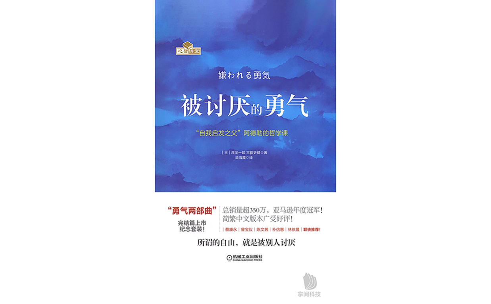
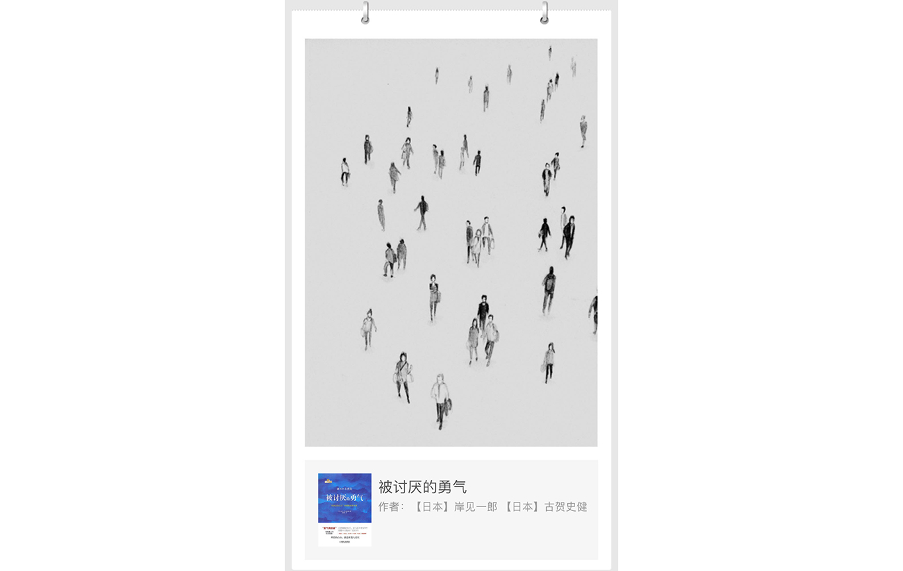

# 《被讨厌的勇气》（一）

> 世界极其简单，人们随时都可以获得幸福。

这本书仿佛有着魔力一般，吸引着我不停地读下去，一页一页翻到最后，长呼一口气。我仿佛书中的青年一样茫然、困惑，“世界是矛盾丛生的一片混沌”，而青年则被“诸多烦恼缠绕”，一路走下来，阴霾的天空洒下仿佛洒下一缕阳光，接下来是层云重新覆盖还是风起云散，还得看自己的思索和勇气。

本书围绕青年和哲人的对话、辩论展开，将阿德勒的心理学徐徐铺展到我们面前，对话体，一下子就想到了《论语》、《理想国》，很容易带入其中，或旁观或参与其中。“阿德勒心理学”被称为现代心理学、个体心理学，不同于原因论，“阿德勒心理学”专注于寻找解决方案，更像是一种哲学，提供看待世界的一个视角。“动机在杭州”写的推荐序二 《自我的加锁和解放》总结的很棒，梳理出一条线贯穿整本书。

他说，“阿德勒最重要的思想主题，是对自我的解放。阿德勒整个理论体系，都在试图把人从这种束缚中解脱出来，让人重获心灵自由。”

我们需要挣脱的束缚有三个：过去、人际关系、未来。

第一个束缚来自**过去**。在多数人的认知里，自己的过去尤其是童年的经历会对自己产生不可撼动的影响，“人”是过去的产物。但阿德勒告诉我们，重要的是不是过去，而是我们怎么看待过去，我们对过去的看法，是可以改变的。我们对过去的过度依赖，使我们下意识逃避责任，把一切都推给过去，自己则躲在自洽的山洞里，不愿出来。我们需要挣脱**过去**的束缚，拿出承担责任的勇气和决心，自己随时都可以**改变**。

第二个束缚来自**人际关系**。我们会被他人的期待和评价所挟持，也会对他人抱有期待或评头论足。阿德勒认为，理想的人际关系大概是“我爱你，但与你无关”，每个人的课题都是分离又独特的，我怎么爱你，这是我的课题，而你要不要接受，这是你的课题。每个人专注与自己的课题，过自己的人生，人和人之间就没那么多纠结和烦恼。这一点也呼应书名，我们是否有着不去寻求认可，不活在他人期待，不自卑，追求自由的勇气？书中会有更多的讨论。

第三个束缚来自**未来**。当我们认为只有成功才是人生真正开始的时候，我们就把现在贬低成了实现未来的工具。**“当你急着奔向未来的时候，说明你已经不喜欢现在了”**。但正如过去不会决定现在一样，现在也不应该成为实现未来的工具。人生正是有一个个名为当下的片段构成，我们要做的是认真跳好每一段当下的舞蹈。

当我们从这些束缚中解脱出来后，会发现我们其实一直很自由，真正让我们裹足不前的，原来正是我们自己。挣脱束缚需要决心和勇气，承担这种自由和责任，更需要无畏的勇气。	

受其鼓舞，我在阅读的时候也不止一次的下决心要改变，去做些什么。但习惯拥有引力，怠惰磨损勇气，一不留神，又已在了重重束缚之下，弄不好我也会如第二部《幸福的勇气》中青年一开始那样，发现阿德勒的思想并没有如预想那般轻易改变自己而怒斥阿德勒思想为妖言惑众，一厢情愿的理想主义，枉顾现实的书屋中的哲学。一口气又看完了《幸福的勇气》，终于鼓起勇气要记录点什么，或许是读书笔记，或许有碎碎念，或许只是大段大段地摘抄，但，改变就从现在开始，什么时候改变都不晚。

