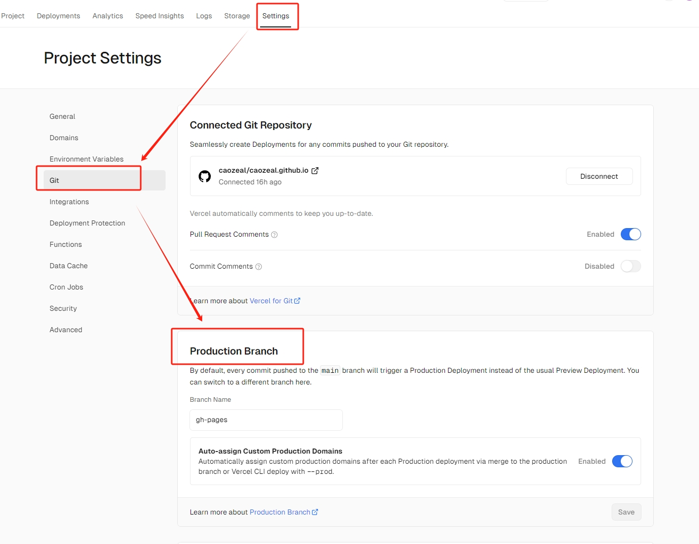
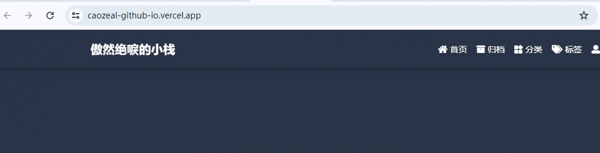
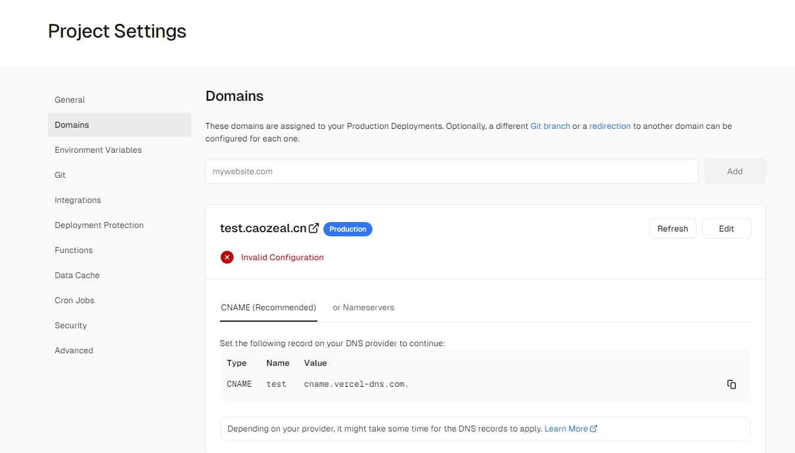
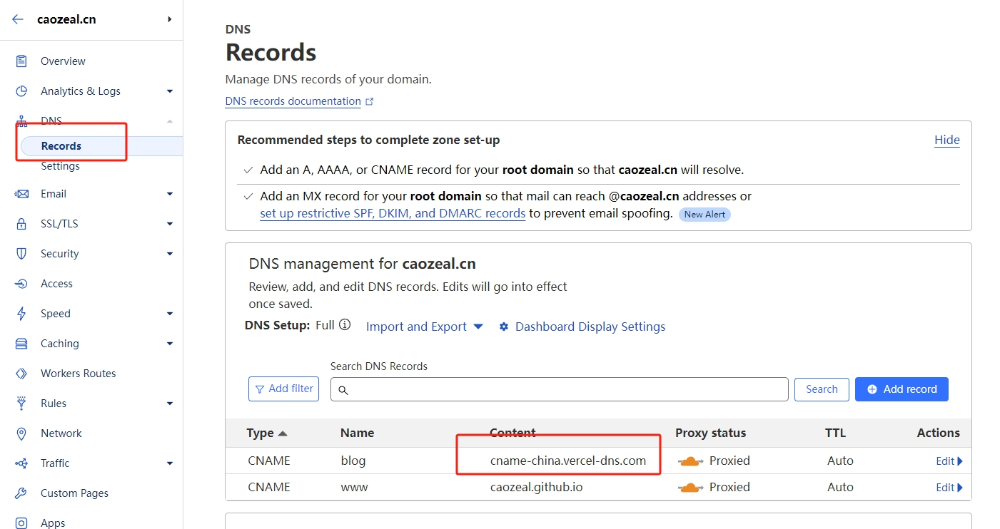
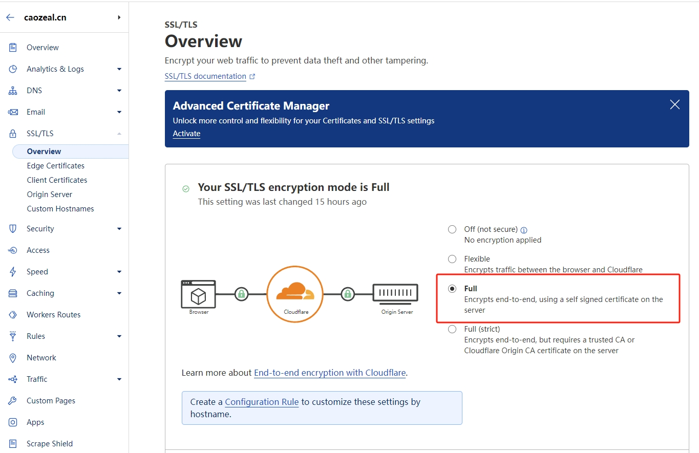
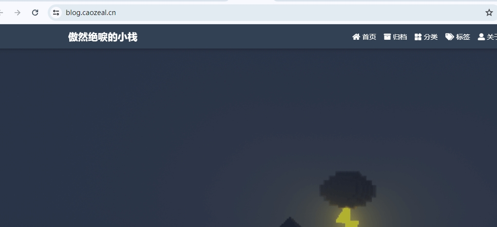

# 个人博客部署以及域名配置

## 一、前言
博客挺久之前就弄了，不过写的文章比较少。最初是用的github pages，github pages的访问速度在国内不是很理想，时常会出现访问不了的情况。后面脑袋一抽，买了个域名，然后接触到了cloudflare，就把域名解析到了cloudflare，使用cloudflare的cdn加速，访问速度有了一些提升。找了几个朋友测试，反馈第一次访问速度还是有点慢，后面会好一些。
最近在github上看到了chat-gpt-next-web，使用了vercel，所以就折腾了下，也用vercel部署了博客，然后通过cloudflare，现在国内访问速度还是可以的。这篇文章主要是记录一下博客的部署过程，以及域名的配置过程。

## 二、vercel
> Vercel is a platform for developers that provides the tools, workflows, and infrastructure you need to build and deploy your web apps faster, without the need for additional configuration.

> Vercel 是一个为开发者提供工具、工作流和基础设施的平台，可以让你更快地构建和部署你的 Web 应用，而无需额外的配置。

vercel官网：[https://vercel.com/](https://vercel.com/)，可以直接使用github账号登录。

### 1. 部署
因为之前已经有了github pages，所以我们可以直接通过vercel部署。Add New -> Project -> 选择自己的git repository -> Import
自动识别出了Hexo, 都采用默认配置，然后Deploy。不出意外的话，出了意外，部署失败了。想到hexo 的deploy branch默认是gh-pages，vercel部署了master分支，所以我们需要修改一下。在vercel的项目中，Settings -> Git -> Production Branch -> gh-pages -> Save。

回头重新部署，却发现部署的还是master，这时注意到`Production Brach`下有一行字
> By default, every commit pushed to the main branch will trigger a Production Deployment instead of the usual Preview Deployment. You can switch to a different branch here.

> 默认情况下，每次推送到主分支的提交都会触发生产部署，而不是通常的预览部署。您可以在这里切换到不同的分支。

生产分支的部署可以通过推送到主分支来触发，二话不说，直接推送到主分支，这时候多出了两条Deployment记录，一条是Preview Deployment，一条是Production Deployment。Production Deployment即是使用了gh-pages分支。

这时候的错误变成了`sh: hexo: command not found`
gp-pages分支通过github的action生成，已经普通的前端静态资源了，无需再使用hexo预设框架，修改Settings -> Build & Development Settings -> Framework Preset 为Other, 重新部署成功。

> 注：我主要是为了同时能使用github pages和vercel，所以使用了gh-pages，如果只是使用vercel，完全可以新建github repository，直接使用master分支。

### 2. 优化
#### a. 域名配置
vercel部署成功后，会有一个网址，（中国大陆地区用户）直接访问这个地址的话，会发现访问不通的情况，这是因为vercel部署的服务都被dns污染了，所以我们管理域名的dns记录，将域名解析到vercel。Settings -> Domains  -> 输入域名 -> Add, 我之前操作过了，这里使用test域名。

添加成功后，会有一个CNAME记录，将这个记录添加到域名的dns记录中，这里使用cloudflare，添加CNAME记录，Content填写`cname.vercel-dns.com`，保存后发现仍然无法访问，那看来`cname.vercel-dns.com`这个地址不能直接使用，搜索网络发现，中国大陆地区用户可以使用`cname-china.vercel-dns.com`，修改CNAME记录，保存。

#### b. 重定向
配置好后，访问报了重定向次数过多的问题，这是因为cloudflare的ssl配置问题，需要将cloudflare的ssl配置为`Full`或者`Full(strict)`，这里使用`Full`，保存后，访问成功。

## 三、总结
这篇文章记录了下博客的部署过程，以及域名的配置过程，主要是使用了github pages，vercel，cloudflare。测试了一下，国内访问速度还是可以的，后续持续观察。

欢迎大家访问：[傲然绝唳的小栈](https://blog.caozeal.cn)